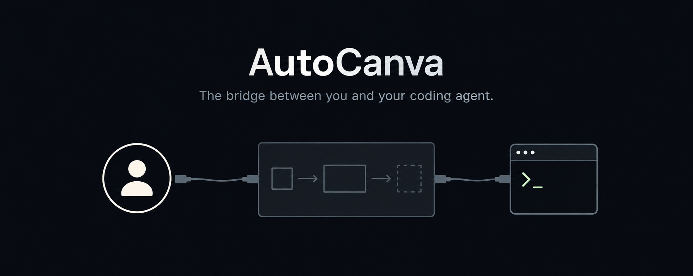

<p align="center">
  
  
  
  
</p>

<p align="center">
  <h1 align="center">AutoCanva</h1>
</p>

<p align="center">
  
</p>

<p align="center">
  Draw your intent. Hand coordinates to a blind coding agent.<br/>
  Get pixel-accurate UI without describing it in words.
</p>

AutoCanva is a tiny Windows desktop app for non-technical people. You open it, drop a reference image as your background, drag **buttons**, **text**, **image placeholders**, **rectangles** and **icons** onto a grid, and click **Export**. You then paste that export into a chat with a coding AI that has no vision, and it can rebuild your layout exactly because every position is given in both **pixels** and **percentages**.

The reference image is **never** exported — it is only a guide for your eyes while you design.

---

## 📑 Table of Contents

- [✨ Features](#-features)
- [🎯 Why](#-why)
- [🚀 Quick Start](#-quick-start)
  - [Requirements](#requirements)
  - [Steps](#steps)
- [📚 Documentation](#-documentation)
  - [Tech Stack](#tech-stack)
  - [Project Structure](#project-structure)
  - [Export Format](#export-format)
- [🗺️ Roadmap](#️-roadmap)

---

## ✨ Features

| Feature | Description |
| ------- | ----------- |
| 🖼️ **Reference Image** | Load any image as a visual-only background. Canvas auto-resizes to match dimensions. |
| 🔲 **Grid + Snap** | Toggleable grid with configurable size. Snap elements to grid lines. |
| 🧩 **5 Element Types** | Button, Text, Image placeholder, Rectangle, Icon marker. Each with its own visual style. |
| ✋ **Drag & Drop** | Click and drag any element. Clamped to canvas bounds. |
| 🔍 **Zoom** | Ctrl+scroll to zoom in/out (0.1×–5×). Ctrl+0 resets. |
| 📐 **Size Controls** | Independent Window and Canvas dimensions. Perfect for targeting specific UI sizes. |
| 🏷️ **Properties Panel** | Edit type, label, position, size, and a free-text comment per element. |
| 💾 **Auto-Save** | Every change is saved to your `.autocanva` project file automatically. |
| 📋 **Export** | One-click copy to clipboard. Deterministic JSON with pixel and percentage coordinates — ready to paste into any chat. |
| ⌨️ **Keyboard Shortcuts** | Arrow keys to nudge, Ctrl+D to duplicate, Delete to remove, Escape to deselect. |

---

## 🎯 Why

Describing *"put the save button a bit to the right of the profile picture"* to an AI is slow and imprecise. AutoCanva turns *"a bit to the right"* into hard numbers an agent can act on — no screen share, no screenshots, no ambiguity.

It exists to bridge the gap between **you** (who can see the UI) and a **vision-less coding agent** (who needs exact coordinates). Design visually, export precisely, hand the export to your AI, and let it build.

---

## 🚀 Quick Start

### Requirements

- Node.js 18+ (tested on 24)
- Windows (the app is designed for Windows, but Electron works on Mac/Linux too)

### Steps

```bash
# Clone the repository
git clone https://github.com/symonchannel-jpg/AutoCanva.git
cd AutoCanva

# Install dependencies
npm install

# Start the app
npm start
```

> **Windows:** Double-click `AutoCanva.bat` to install and start — no terminal needed.

The app window opens immediately. No build step, no bundler, no configuration.

---

### Preview Your Export

Before handing the export to an AI, you can preview it locally with `preview.html`:

```bash
# Open preview.html in your browser (double-click or:)
start preview.html
```

1. **Paste** the export JSON into the page (it comes with a sample pre-loaded)
2. The layout renders automatically using the `rel*` percentages mapped to the target window size
3. Verify buttons, text, and all elements are positioned correctly
4. If it looks right, paste the export into your AI chat

> `preview.html` is a standalone file — no server, no dependencies. It simulates the downstream agent: it reads the export and renders elements purely by coordinates, just like your AI will.

---

## 📚 Documentation

### Tech Stack

| Layer      | Technology                        |
| ---------- | --------------------------------- |
| Shell      | Electron 33+                      |
| Language   | JavaScript (no TypeScript)        |
| Bundler    | None — files load via `file://`   |
| UI         | Vanilla DOM + CSS                 |
| State      | Single plain JS module (`store.js`) |
| Persistence | Hand-rolled JSON on disk via IPC  |
| Styling    | One `styles.css`, CSS variables for dark theme |

### Project Structure

```
autocanva/
├── AGENTS.md              # Rules for any coding agent working on this project
├── PLAN.md                # Step-by-step build plan
├── preview.html           # Preview tool: paste an export to render the layout visually
├── docs/
│   ├── ARCHITECTURE.md    # Runtime and data-flow description
│   ├── EXPORT_FORMAT.md   # Canonical export schema (do not break)
│   └── ROADMAP.md         # Ideas explicitly deferred from MVP
├── examples/
│   └── sample.autocanva   # Example project file
└── src/
    ├── main/main.js       # Electron main process
    ├── preload/preload.js # Secure IPC bridge
    └── renderer/
        ├── index.html     # The window's UI
        ├── styles.css     # All styles, dark theme
        ├── store.js       # Single source of state
        └── renderer.js    # UI logic and drag engine
```

### Export Format

Each element exports as a JSON object with **pixel coordinates** and **relative percentages**, plus a free-text `comment` field. The top-level object records canvas config, window target, and a timestamp.

```json
{
  "app": "autocanva",
  "schemaVersion": 1,
  "generatedAt": "2026-01-01T00:00:00.000Z",
  "canvas": { "windowWidth": 1280, "windowHeight": 720, "canvasWidth": 800, "canvasHeight": 600 },
  "elements": [
    {
      "type": "button",
      "id": "btn_01",
      "label": "Save",
      "x": 120, "y": 80,
      "width": 96, "height": 32,
      "relX": "15.00", "relY": "13.33",
      "relWidth": "12.00", "relHeight": "5.33",
      "comment": "primary action, blue background"
    }
  ]
}
```

See `docs/EXPORT_FORMAT.md` for the full contract.

---

## 🗺️ Roadmap

### MVP (current)
- [x] Electron window with dark theme
- [x] Canvas with resizable dimensions
- [x] Toggleable grid with snap-to-grid
- [x] Reference image background (visual-only)
- [x] Five element types (button, text, image, rect, icon)
- [x] Drag & drop with canvas clamping
- [x] Zoom in/out (Ctrl+scroll)
- [x] Properties panel (type, label, position, size, comment)
- [x] Auto-save to `.autocanva` file
- [x] Export to clipboard with prompt text
- [x] Keyboard shortcuts (arrows, delete, duplicate, esc)

### Planned
- [ ] Undo / Redo (Ctrl+Z / Ctrl+Y)
- [ ] Resize handles on elements
- [ ] Multi-select with shift-click
- [ ] Windows `.exe` packaging
- [ ] Color picker per element
- [ ] Element grouping

---

<p align="center">
  <sub>Built with ❤️ for humans who can see and AIs who can't.</sub>
</p>
